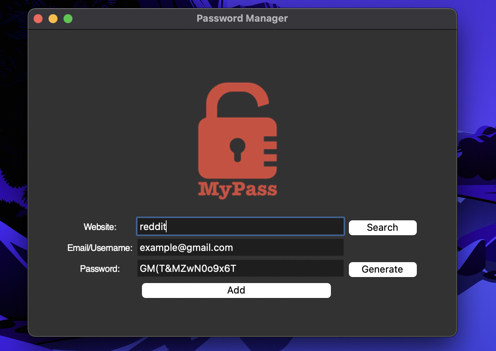
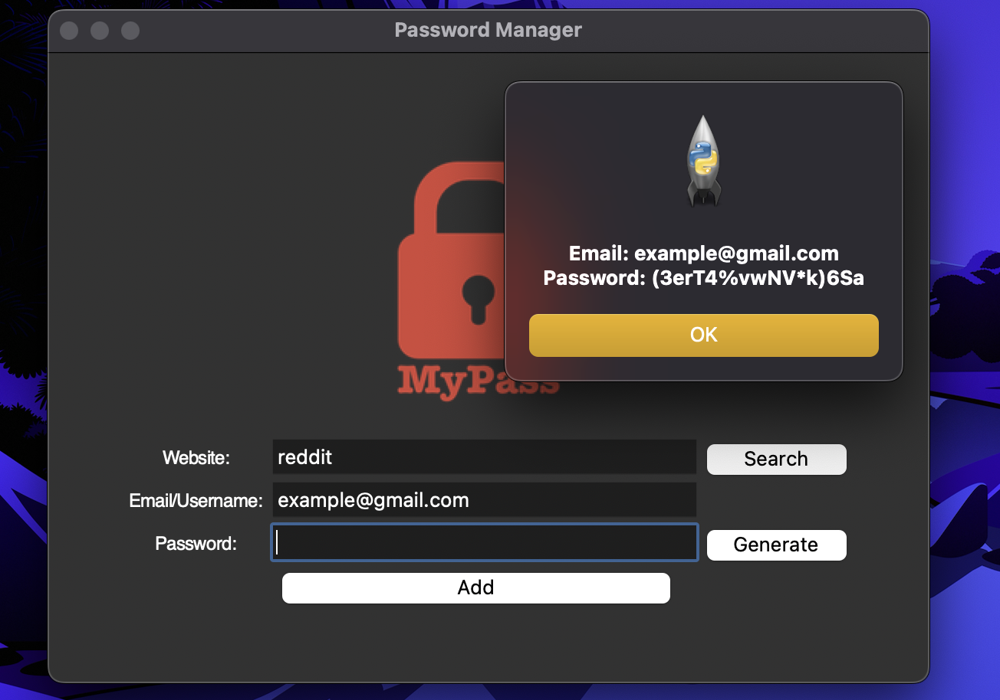
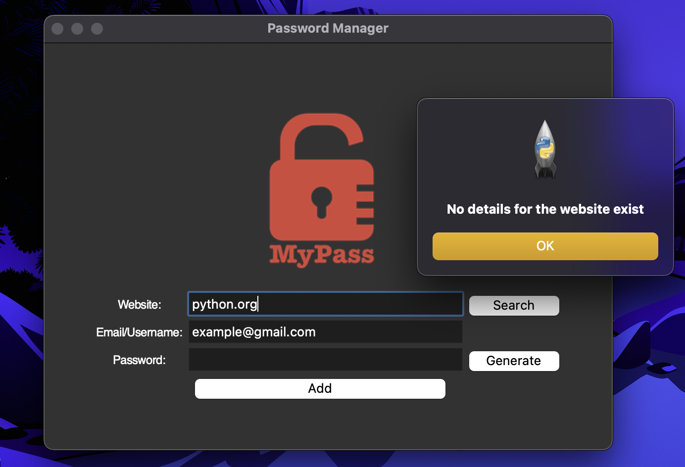

<h1 align="center">PASSWORD MANAGER</h1>

## Description
Welcome to the password manager project! This project is designed to help you manage your passwords and login information in an efficient manner.

With the password manager, you can easily generate complex passwords to keep your accounts secure. You can also save login information, including the resource name and password, to the database. This helps to keep track of all of your login information in one place.
<p align="center">


</p>
In addition to storing login information, the password manager also allows you to search for a specific resource and display the login and password for it. 
<p align="center">


</p>
 If the password for a resource is not found, the password manager will report this to you.
<p align="center">


</p>
Overall, the password manager is a useful tool for anyone looking to manage their login information in a convenient manner.

### About the project.
The password manager is built using Python and the tkinter library for the graphical user interface. The database is stored in a json file, which allows for easy storage and retrieval of your login information.

## Project setup

Inside Terminal:

```
On Mac
python3 main.py run

Windows
python main.py run
```